  

<!-- PROJECT LOGO -->
 

  <a href="https://github.com/othneildrew/Best-README-Template">
    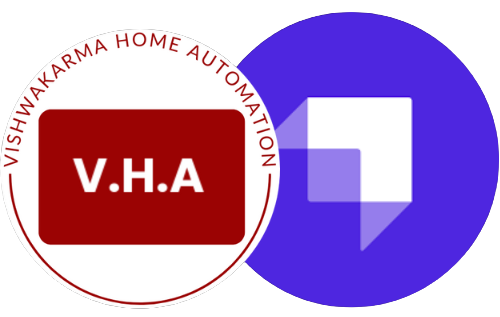
  </a>
  
  <h3 align="center"><b>HomeAutomationSchema</b></h3>

  

    Schema is very important for structuring any data and this project is database structure of <a href="https://github.com/gv211432/home-automation-website">this</a> project
     
    <a href="#"><strong>Explore the docs »</strong></a>
     
     
    <a href="https://github1s.com/gv211432/HomeAutomationSchema">View Demo</a>
    ·
    <a href="https://github.com/gv211432/HomeAutomationSchema/issues">Report Bug</a>
    ·
    <a href="https://github.com/gv211432/HomeAutomationSchema/issues">Request Feature</a>
  

<!-- ABOUT THE PROJECT -->

## ☑️ About The Project

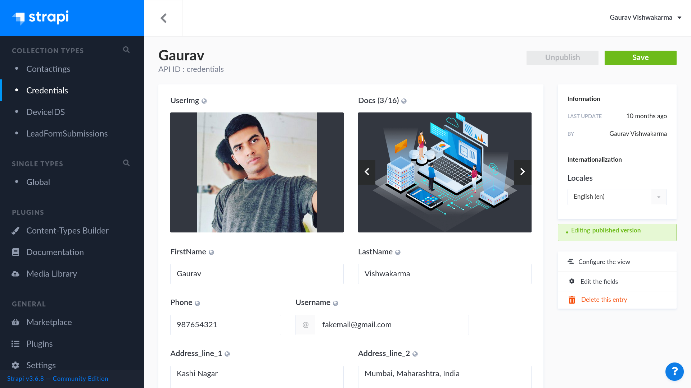

**❓ What is Schema?** 

A database schema defines how data is organized within a relational database; this is inclusive of logical constraints such as, table names, fields, data types, and the relationships between these entities. Schemas commonly use visual representations to communicate the architecture of the database, becoming the foundation for an organization’s data management discipline. This process of database schema design is also known as data modeling.

Choosing the right database schema for your application impacts performance and your ability to quickly adapt to evolving business requirements. A flexible data model, such as the one found in MongoDB, lets you store or aggregate any type of data and dynamically change schema without application downtime.

Data in MongoDB is stored in documents and similarly structured documents are typically organized into collections. Also, MongoDB documents tend to have all data for a given record in a single document.

This project is developed by [me](https://github.com/gv211432)

## ❓ What is Strapi?

The original purpose of the project was to help Bootstrap your API: that's how Strapi was created. Now, Strapi is an open-source headless CMS that gives developers the freedom to choose their favorite tools and frameworks and allows editors to manage and distribute their content using their application's admin panel. Based on a plugin system, Strapi is a flexible CMS whose admin panel and API are extensible - and which every part is customizable to match any use case. Strapi also has a built-in user system to manage in detail what the administrators and end users have access to.

## ⚙️ Installation 

### First install [MongoDB](https://www.mongodb.com/docs/manual/installation/)
### After installing MongoDB install [Strapi](https://docs.strapi.io/developer-docs/latest/getting-started/quick-start.html)

❗️ WARNING

Strapi applications are not meant to be connected to a pre-existing database, not created by a Strapi application, nor connected to a Strapi v3 database. The Strapi team will not support such attempts. Attempting to connect to an unsupported database may, and most likely will, result in lost data.

1. Just clone this project by command `git clone https://github.com/gv211432/HomeAutomationSchema.git`
2. Go to the cloned folder by command `cd HomeAutomationSchema`
3. Run the command `npm install`
4. then run the command `num audit fix --force`
5. finally run the command `npm start`

### `npm install`
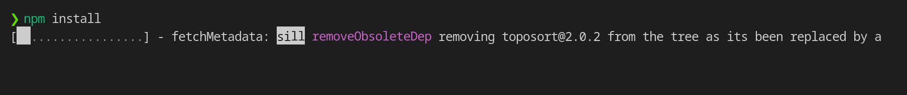

### `npm audit fix --force`
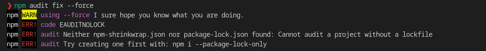

### `npm start`
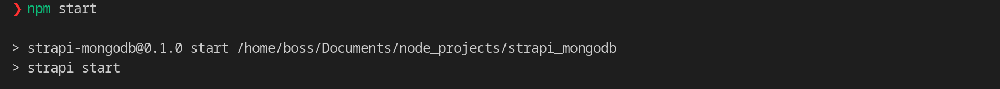
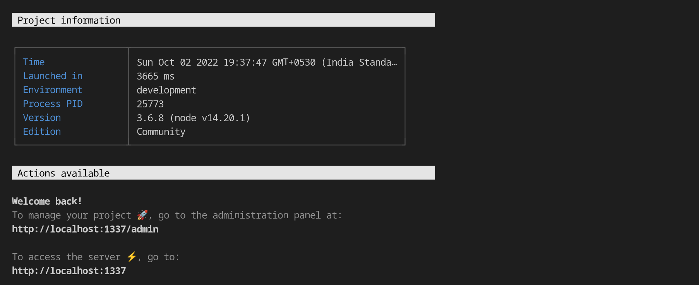

### `Login to the strapi admin console`
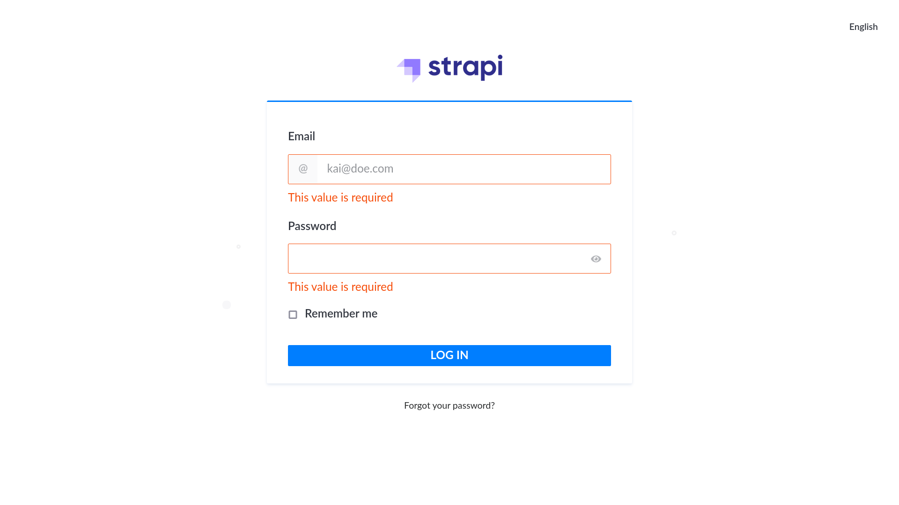

## 🔧 Extra Snapshots

Following snaps are for debugging how thing look and what all thing you have to create, etc.
 
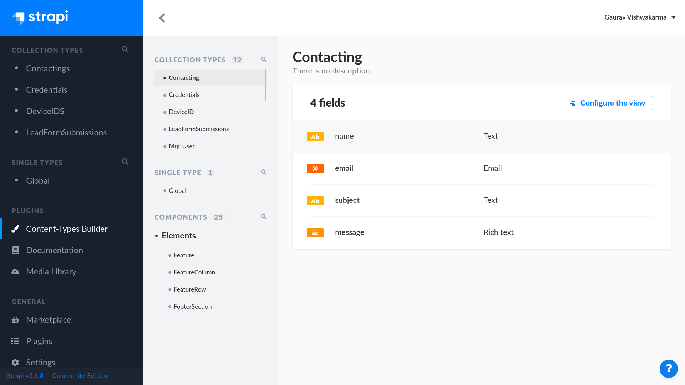

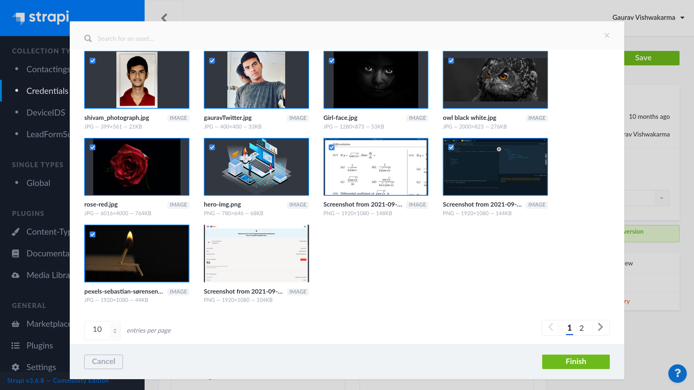

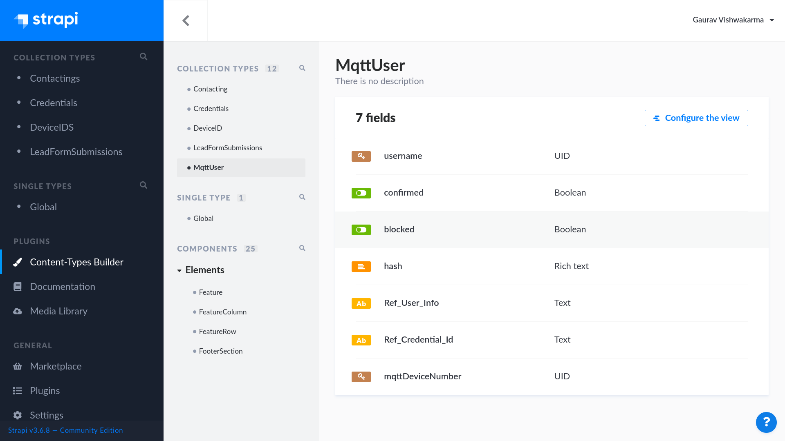

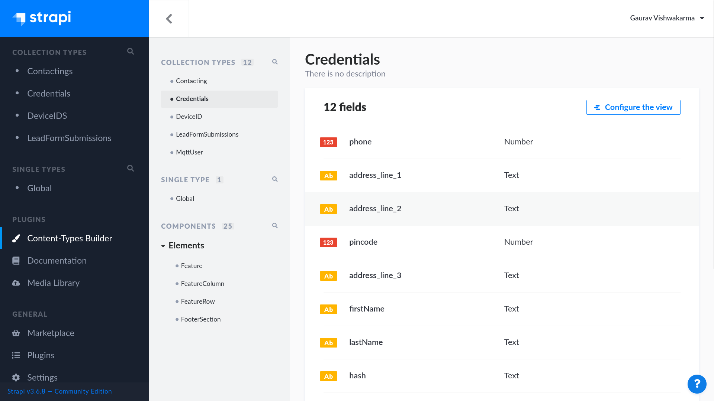

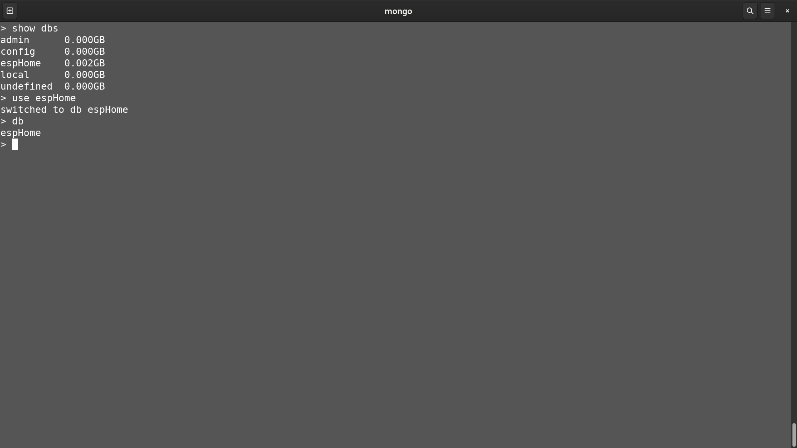

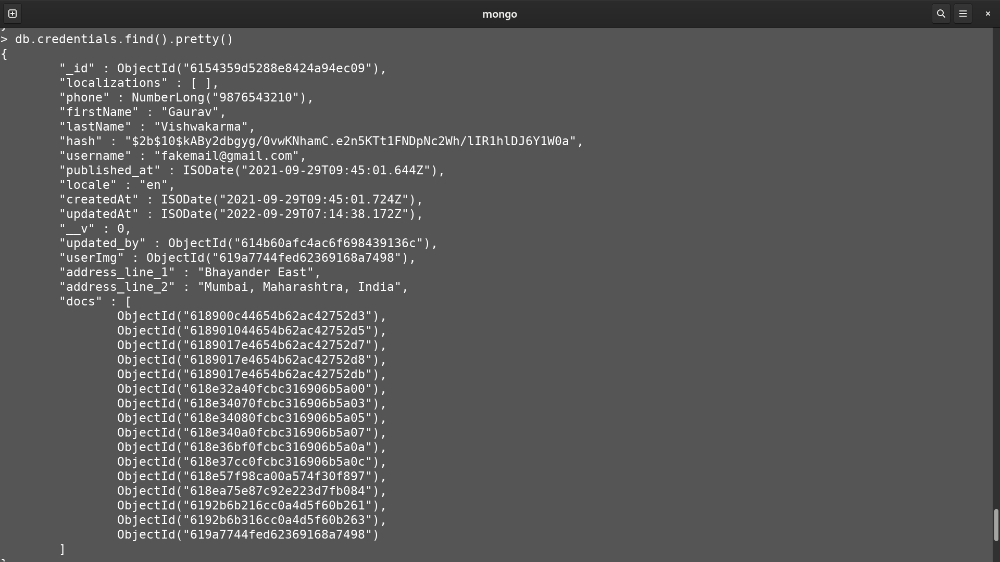

## 📖 License 

  [MIT](https://github.com/gv211432/boxes/blob/main/LICENSE)
